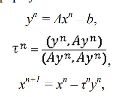

# Параллельная реализация решения системы линейных алгебраических уравнений с помощью MPI

## Задача

1. Написать программу на языке C или C++, которая реализует итерационный алгоритм решения системы линейных алгебраических уравнений вида Ax=b, используя метод минимальных невязок. Здесь A – матрица размером N×N, x и b – векторы длины N. Тип элементов – double. 
2. Распараллелить с помощью MPI:
- 2.1. векторы x и b дублируются в каждом MPI-процессе
- 2.2. векторы x и b разрезаются между MPI-процессами аналогично матрице A
3. Замерить время на разном количестве процессов

## Метод минимальных невязок

### Более подробное описание в word
